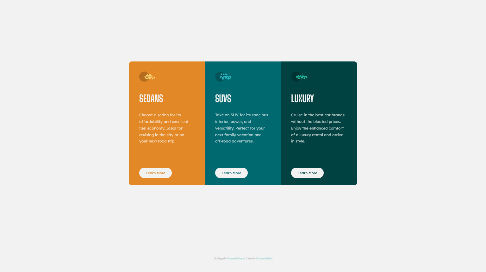

# Frontend Mentor - 3-column preview card component solution

This is a solution to the [3-column preview card component challenge on Frontend Mentor](https://www.frontendmentor.io/challenges/3column-preview-card-component-pH92eAR2-).

## Table of contents

- [Overview](#overview)
  - [The challenge](#the-challenge)
  - [Screenshot](#screenshot)
  - [Links](#links)
- [My process](#my-process)
  - [Built with](#built-with)
  - [What I learned](#what-i-learned)
  - [Continued development](#continued-development)
- [Author](#author)

## Overview

### The challenge

Users should be able to:

- View the optimal layout depending on their device's screen size
- See hover states for interactive elements

### Screenshot



### Links

- Solution URL: (https://github.com/marianarainha/column-preview-card-component)
- Live Site URL: (https://marianarainha.github.io/column-preview-card-component/)

## My process

### Built with

- Semantic HTML5 markup
- CSS custom properties
- Flexbox

### What I learned

CSS custom properties on the :root pseudo-class to reduce the need for repetition:

```css
:root {
  --brightOrange: hsl(31, 77%, 52%);
  --darkCyan: hsl(184, 100%, 22%);
  --veryDarkCyan: hsl(179, 100%, 13%);
  --transparentWhite: hsla(0, 0%, 100%, 0.75);
  --veryLightGray: hsl(0, 0%, 95%);
}
```

Media queries to change the border radius of the cards for mobile display.

```css
@media screen and (max-width: 700px) {
  #orangeCard {
    border-radius: 0.5rem 0.5rem 0 0;
  }

  #greenCard {
    border-radius: 0 0 0.5rem 0.5rem;
  }
}
```

### Continued development

I couldn't figure it out how to set different borders radius to the cards when they'are wrapped so it can look like the mobile-design.
Should I use @media ? How ?

## Author

- Frontend Mentor - [@marianarainha](https://www.frontendmentor.io/profile/yourusername)
